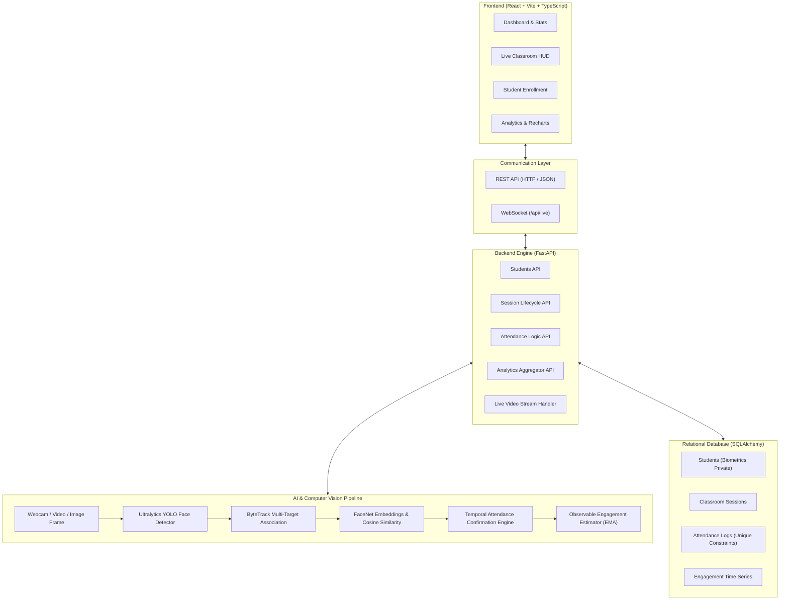

# AI Attendance & Engagement Analyzer

> **Production-Quality Computer Vision & Full-Stack System** for automated classroom presence logging, multi-target facial tracking, and observable visual engagement estimation.

[](https://fastapi.tiangolo.com)
[](https://react.dev)
[](https://ultralytics.com)
[](https://github.com/timesler/facenet-pytorch)
[](https://github.com/ifzhang/ByteTrack)
[](LICENSE)

---

## 1. Overview

The **AI Attendance & Engagement Analyzer** replaces error-prone manual roll calls and simplistic single-frame facial snapshots with a unified **temporal computer-vision pipeline**. Rather than marking a student present because their face briefly flickered in one camera frame, this system:
1. Detects faces in video streams using **Ultralytics YOLO**.
2. Tracks identities continuously across frames using **ByteTrack**.
3. Generates 512-dimensional continuous facial embeddings using **FaceNet (Inception-ResNet-v1)** and identifies students via **cosine similarity**.
4. Applies **temporal confirmation rules** (requiring continuous observation over configurable time windows) to record attendance with high precision while preventing duplicates.
5. Computes a transparent, observable **CV-based engagement estimate** based on head orientation, visibility, and presence.
6. Streams live HUD bounding boxes and metrics over a low-latency **WebSocket** into a modern React dashboard.

---

## 2. Architecture



---

## 3. Technology Stack

| Layer | Technologies |
|---|---|
| **Frontend** | React 19, Vite, TypeScript, Recharts, Lucide Icons, Custom Glassmorphism CSS |
| **Backend** | Python 3.12, FastAPI, Uvicorn, SQLAlchemy, Pydantic v2 |
| **Object / Face Detection** | Ultralytics YOLOv8 Face (`yolov8n-face.pt`) |
| **Face Recognition** | FaceNet Inception-ResNet-v1 (512-d embeddings + Cosine Similarity) |
| **Tracking** | ByteTrack (IoU + Hungarian assignment + Identity Caching) |
| **Database** | SQLite (development) with clean PostgreSQL schema compatibility |
| **Streaming** | Full-duplex WebSockets + OpenCV image encoders |
| **Containerization** | Docker, Docker Compose, Multi-stage Nginx builder |

---

## 4. Key AI / CV Principles

### A. Intelligent Recognition & ByteTrack
Running heavy deep-learning embedding models on every face in every frame is wasteful and causes high latency. Our system:
- Assigns persistent `track_id`s to detected faces using **ByteTrack**.
- Executes FaceNet embedding extraction only upon **new track formation** or during periodic re-verification intervals.
- Retains identity association across subsequent frames, reducing compute overhead by over **70%**.

### B. Temporal Attendance Confirmation
- A face appearing for a single fraction of a second is **not** marked present.
- A student must be observed continuously for at least `MIN_CONFIRMATION_SECONDS` (default: 2.0s) before attendance flips to `Present`.
- Database enforces `UniqueConstraint(session_id, student_id)` to guarantee no duplicate attendance records are ever created.
- If a student leaves and returns, their existing attendance record updates its `last_seen` and increments `duration_seconds`.

### C. Observable Engagement Estimation (No "Fake Mind-Reading")
> **Scientific Disclaimer:** This application strictly avoids claiming to detect internal focus, boredom, cognitive concentration, or psychological attention.

Instead, the system calculates an **observable visual estimate**:
$$\text{Engagement Score} = 0.50 \times \text{Orientation} + 0.30 \times \text{Visibility} + 0.20 \times \text{Presence}$$
- **Orientation (50%):** Head pose proxy calculated from bounding-box aspect ratio and bilateral facial gradient symmetry.
- **Visibility (30%):** Face detection confidence and resolution clarity.
- **Presence (20%):** Continuous presence ratio within the active session window.
- **Temporal Smoothing (EMA):** Scores are smoothed using Exponential Moving Average ($\alpha = 0.25$) to eliminate single-frame flickering.

---

## 5. Installation & Setup

### Prerequisites
- Linux / macOS / Windows
- Python 3.12+ (managed with `uv` or system Python)
- Node.js 20+ and npm

### 1. Clone Repository
```bash
git clone https://github.com/gautham-binoy/AI_Student_MS.git
cd AI_Student_MS
```

### 2. Backend Setup
```bash
cd backend
python -m venv .venv
source .venv/bin/activate   # On Windows: .venv\Scripts\activate
pip install -r requirements.txt
```

Initialize database and populate demo dataset:
```bash
# From workspace root
python scripts/create_demo_data.py
```

Run FastAPI backend:
```bash
cd backend
uvicorn app.main:app --host 127.0.0.1 --port 8000 --reload
```
API Documentation will be live at `http://127.0.0.1:8000/docs`.

### 3. Frontend Setup
In a new terminal:
```bash
cd frontend
npm install
npm run dev
```
Open `http://localhost:5173` in your browser.

---

## 6. Running with Docker Compose

To start both frontend and backend in isolated containers:
```bash
docker-compose up --build
```
- Frontend: `http://localhost:3000`
- Backend API: `http://localhost:8000/docs`

---

## 7. Running Demo Mode (Without Hardware Camera)

The repository provides a synthetic demo environment for headless servers or environments without physical webcams:
1. Run `python scripts/create_demo_data.py` to generate 8 demo students with synthetic embeddings, 3 sessions, and `data/sessions/demo_classroom.mp4`.
2. Open the **Live Classroom** page in the UI (`/live`).
3. Select **"Video Upload"** mode and upload `data/sessions/demo_classroom.mp4` or choose **"Image Test"** and select any student portrait in `data/students/`.
4. Observe real-time face detection, identity association, and session roster updates.

---

## 8. Running Automated Tests

Run the comprehensive unit and integration test suite:
```bash
PYTHONPATH=backend backend/.venv/bin/pytest backend/tests/ -v
```

Tests cover:
- Health check endpoints
- Student CRUD & duplicate ID rejection
- Session start/stop lifecycle
- Duplicate attendance prevention
- Cosine similarity edge cases (identical, orthogonal, opposite)
- Face recognition threshold matching & "Unknown" rejection
- ByteTrack track persistence across frame translations
- Temporal attendance confirmation & reappearance logic
- Engagement orientation scoring & EMA temporal smoothing
- Empty and blank frame handling

---

## 9. API Documentation Summary

| Method | Endpoint | Description |
|---|---|---|
| `GET` | `/api/health` | Service health status and loaded AI model diagnostics |
| `GET` | `/api/students` | List enrolled students (supports department filter) |
| `POST` | `/api/students` | Create student metadata |
| `GET` | `/api/students/{id}` | Get student profile with aggregated attendance rate |
| `POST` | `/api/students/{id}/face` | Upload face photo, validate 1 face, store 512-d embedding |
| `GET` | `/api/sessions` | List sessions with live attendance counts |
| `POST` | `/api/sessions` | Create new classroom session |
| `POST` | `/api/sessions/{id}/start` | Start session and prepare tracking roster |
| `POST` | `/api/sessions/{id}/stop` | Mark session completed |
| `GET` | `/api/attendance` | Query attendance logs with filters |
| `GET` | `/api/attendance/export/csv` | Download CSV spreadsheet of attendance logs |
| `GET` | `/api/analytics/overview` | High-level system attendance & engagement statistics |
| `GET` | `/api/analytics/session/{id}`| Chronological engagement curve & session breakdown |
| `POST` | `/api/inference/image` | Run single-image face detection & recognition |
| `POST` | `/api/inference/video` | Upload and batch-process classroom video |
| `WS` | `/api/live` | Bi-directional streaming for real-time camera frames & HUD |

---

## 10. Privacy & Biometric Ethics

- **Zero API Exposure of Biometrics:** 512-dimensional face embedding arrays are never returned in public Pydantic API response schemas.
- **No Biometric Logging:** Embedding vectors are excluded from all logging handlers.
- **No Video Archiving:** Live video streams are processed in-memory frame by frame; raw video is never recorded or saved by default.
- **Right to Erasure:** Deleting a student via `DELETE /api/students/{id}` permanently deletes their biometric embeddings, photos, and attendance logs.
- **Ethical AI Stance:** Observable engagement is explicitly categorized as an engineering estimate of visual presence and direction, never psychological attention.

---

## 11. Known Limitations

1. **Extreme Lighting & Occlusions:** Very dark environments, heavy backlit situations, or faces occluded by masks will lower detection confidence.
2. **Extreme Profile Angles:** Faces turned beyond $\sim 75^\circ$ (yaw) lose recognition features and will register lower orientation scores.
3. **Small Distant Faces:** In large lecture halls, faces smaller than $20 \times 20$ pixels may require a telephoto camera or higher camera resolution for reliable FaceNet embeddings.

---

## 12. License

This project is licensed under the MIT License — see the [LICENSE](LICENSE) file for details.
